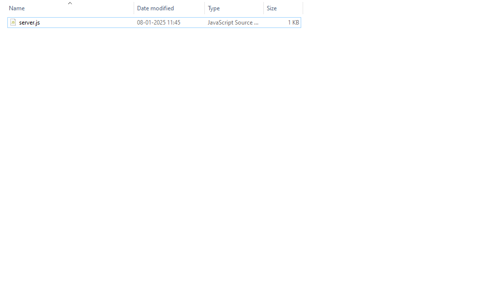
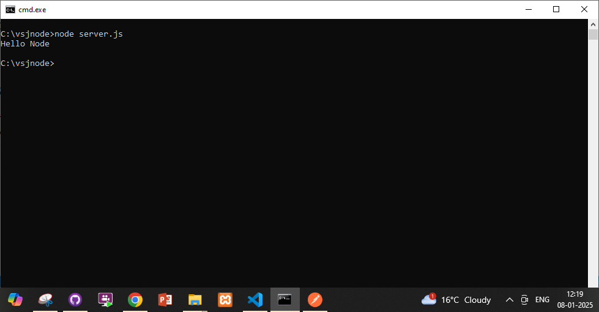

# Starting a Node.js project from the beginning.

How to install Node.
1. Begin with downloading and installing node from this location
[Download Node.js](https://nodejs.org/en/download)
Starting a node project requires making a js file inside a folder.
Here is our project

It contains only 1 file. This the content of our file server.js

The file has only one statement.
console.log("Hello Node");

To run it go to the command prompt and type node server.js

 
