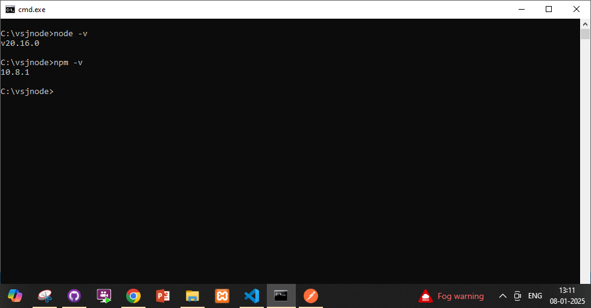

# Node js commands that we will use
Getting the node version and the npm version

Initializing a project.
npm init
will ask for packages to install

npm init -y
will install default packages.

both of them will create a package.json file
npm init will ask package names, while npm init -y will create package.json with default values.

